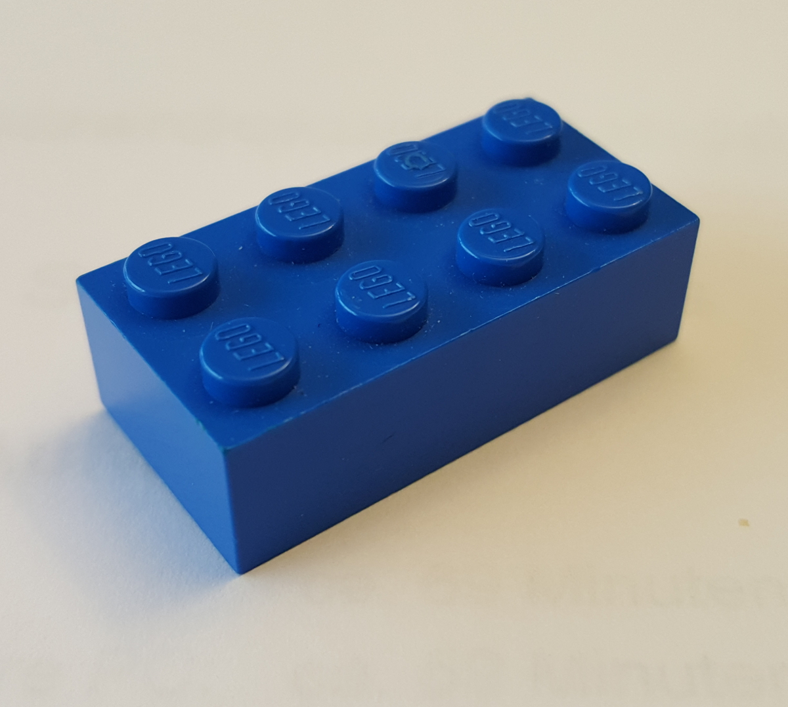
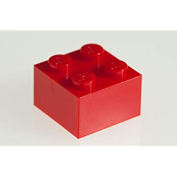
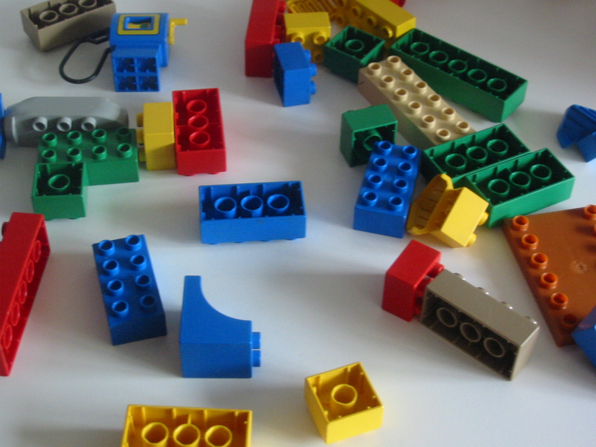
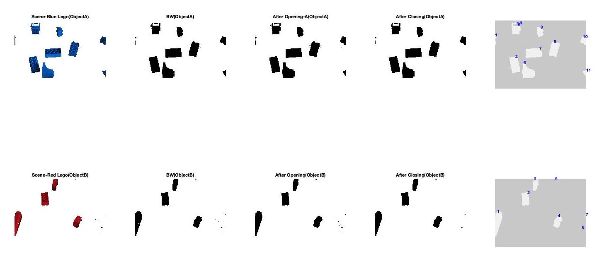

# Object-Counting

Provides a count of the number of Blue 2 by 4 bricks (ObjectA) and the number of Red 2 by 2 bricks (ObjectB) in such an image. Close-up images of these two types of LEGO brick are displayed below:

 

## Image Processing Steps

COUNT_LEGO performs colour based thresholding to segment the cluttered
image into two components - blue and red. This is the first segmentation
step to distinguish between the two objects being identified. 
The next step involved further image processing to count the objects in
the image and the utilization of REGIONPROPS to
generate image properties such as the area and perimeter of the blobs.
The classification is based on the magnitude of the areas of the blobs.

## Future Tasks:
- [ ] Look into a combination of using areas and shape recognition for the classification stage
- [ ] Alternative algorithms - BOW, Template Matching
- [ ] Feret Properties of the blobs - https://blogs.mathworks.com/steve/2018/04/17/feret-properties-wrapping-up/
